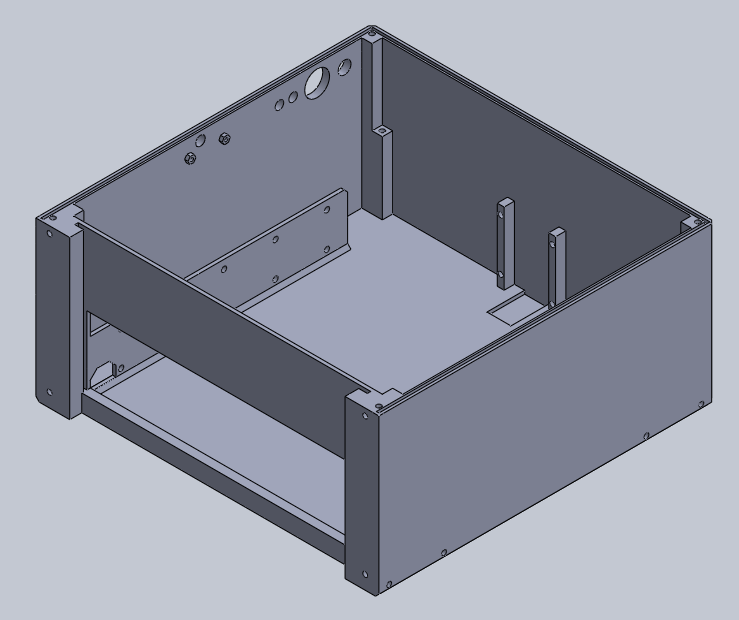
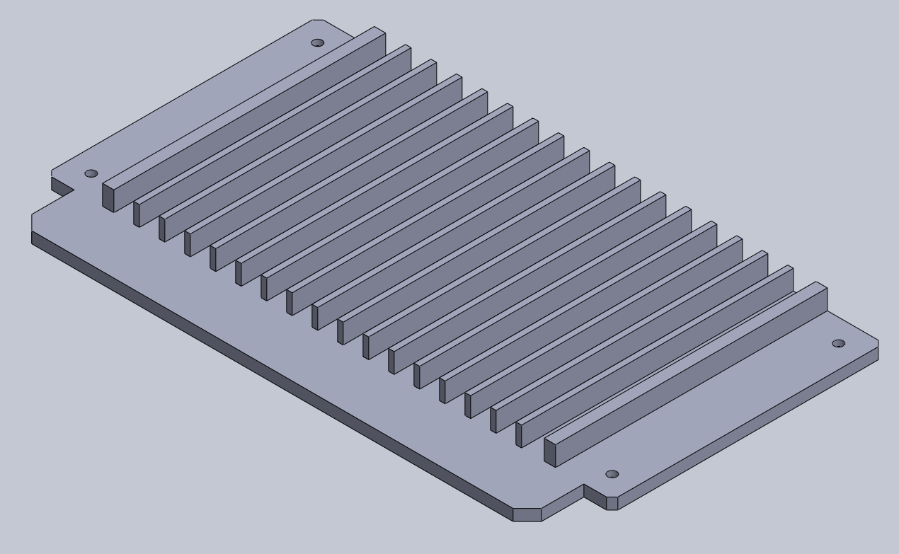
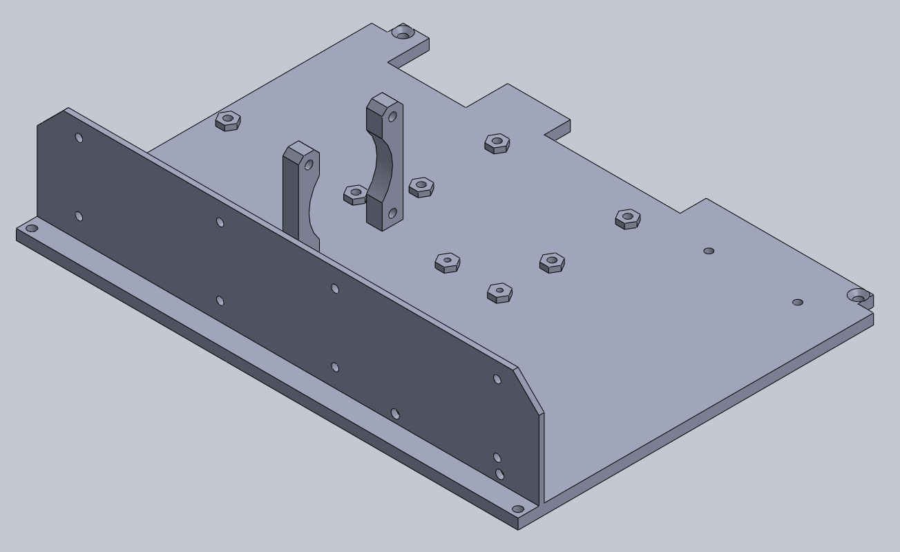
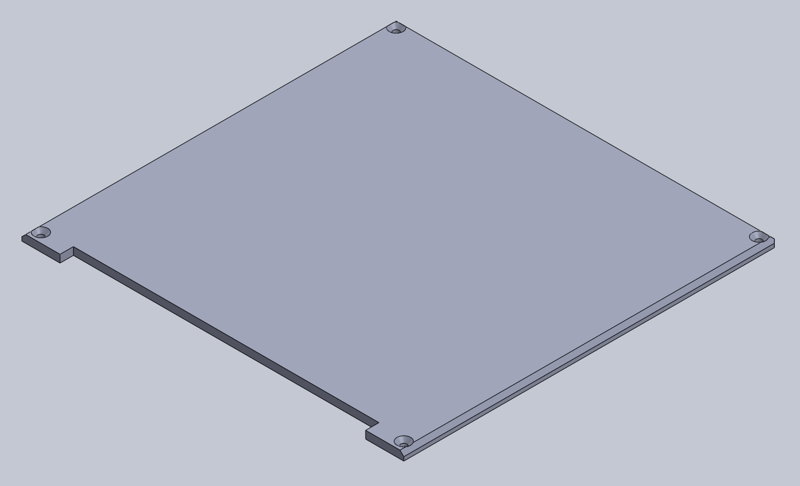
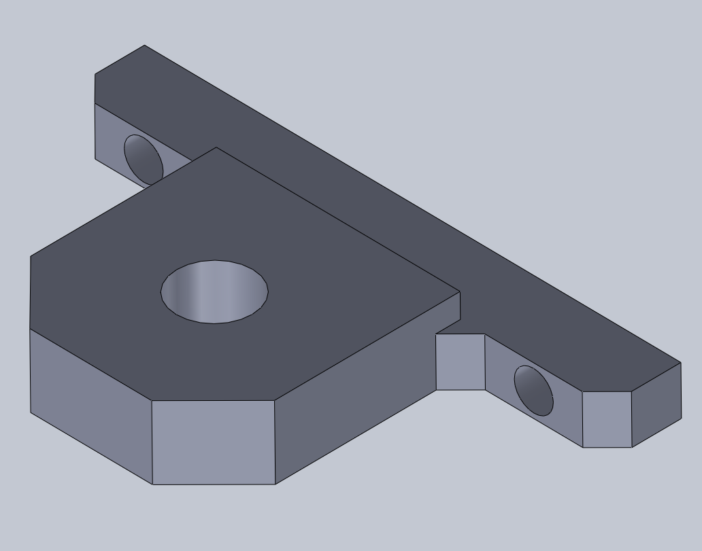
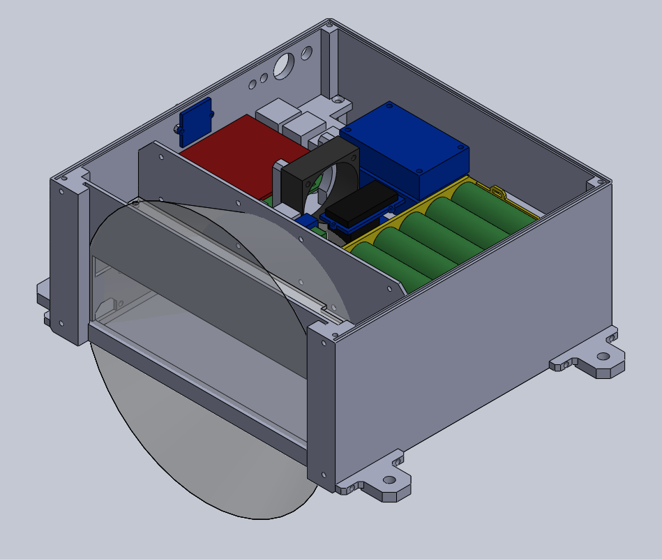
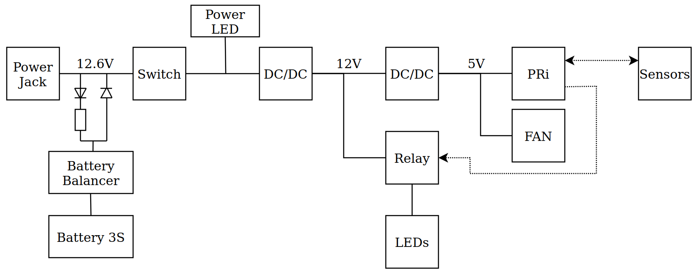
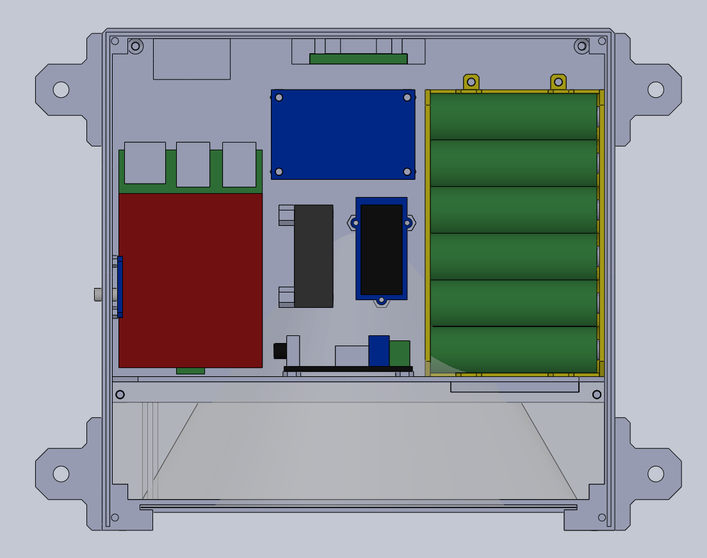
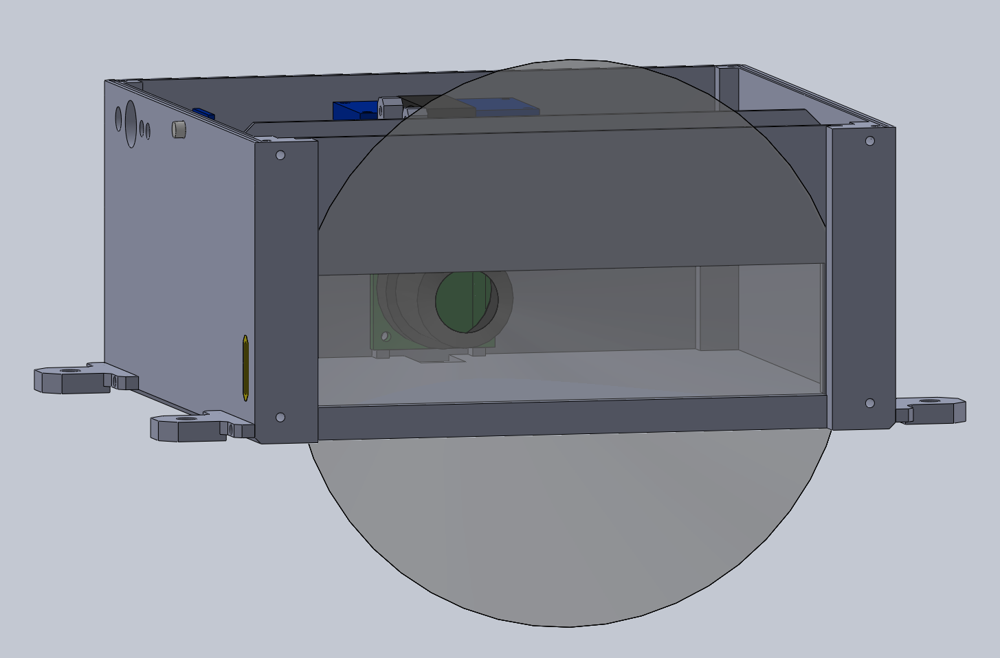
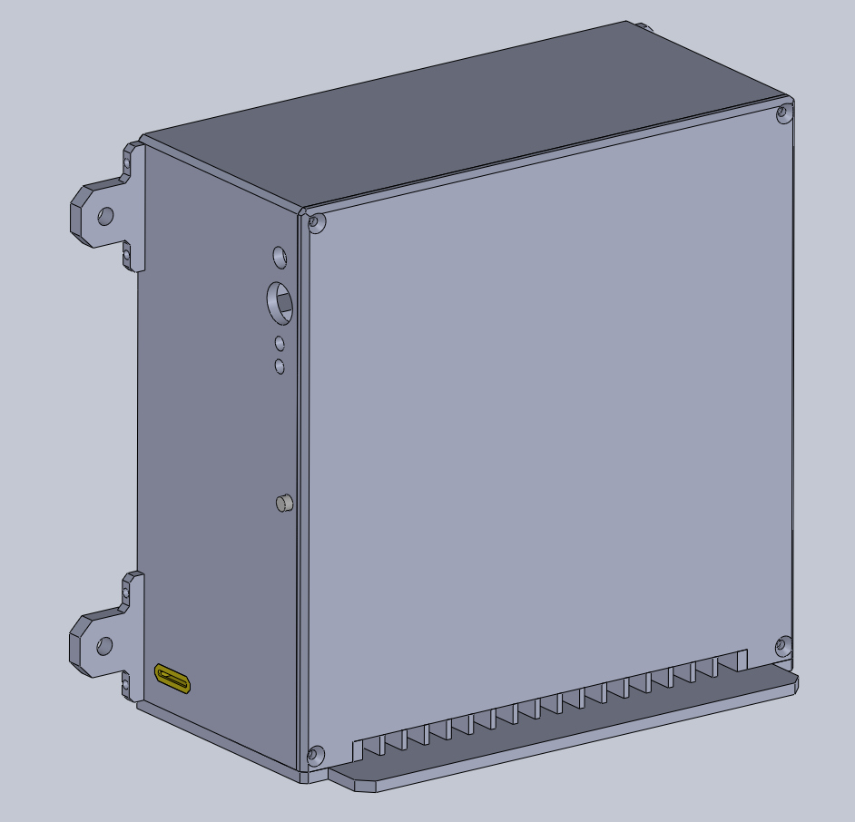

# BeeLogger - Hardware setup

The folder contains a brief overview of how the device is constructed.
It contains the .STL and files of 3D printed parts, .DXF file of a laser-cut plastic window and a brief overview of how to assemble the entire device.
Also, the BOM of electronic componentes is apended.

## 3D Printed Parts and Laser Cut

Recommended 3D print infill ~15%

1x Main frame 

1x Bottom (bee tunnels)

1x Middle (electronics mount layer)

1x Top cover

1x Battery pack (6x 18650)

4x Helper mount hole

1x Laser-cut plastic window. Window suppose to be light diffuser and to be non-transparent. After cutting it, scratch it and glue white paper on it.

## Assembly

Inner layout of the assembled device

Electrical scheme. The battery resistor choose in the way, so the charging current will be between 1/10 and 1/100 of a battery capacity. 

Inner electronics layout

Camera's Filed of view

General overview of the assembled device

## BOM

| Part                                                                                                                                                                                                                                                                                                                                                                                                                                                                                          | Quant. |
|-----------------------------------------------------------------------------------------------------------------------------------------------------------------------------------------------------------------------------------------------------------------------------------------------------------------------------------------------------------------------------------------------------------------------------------------------------------------------------------------------|--------|
| [Raspberry Pi 4](https://www.amazon.com/Raspberry-Model-2019-Quad-Bluetooth/dp/B07TC2BK1X/ref=sr_1_3?crid=3DNPLNTMRC0AU&keywords=raspberry+pi+4&qid=1657797906&sprefix=raspberry+pi+4%2Caps%2C250&sr=8-3)                                                                                                                                                                                                                                                                                     | 1      |
| [RPI HQ Cam](https://www.amazon.com/Arducam-Raspberry-Camera-Sensitivity-Adapter/dp/B09YHN5DBY/ref=sr_1_13?crid=3JH802ACAZP61&keywords=rpi+HQ+camera+lens&qid=1657798011&sprefix=rpi+hq+camera+len%2Caps%2C123&sr=8-13) + lens                                                                                                                                                                                                                                                                | 1      |
| [18650 Battery](https://www.amazon.com/dp/B0B6FSJ64C/ref=sr_1_6?keywords=18650+battery&qid=1657797820&s=hpc&sr=1-6)                                                                                                                                                                                                                                                                                                                                                                           | 6      |
| [Bat. Balancer](https://dratek.cz/arduino/1675-ochranny-modul-pro-li-ion-lithiovou-baterii-3s-11.1v-12.6v-25a.html?hp=&mena=2)                                                                                                                                                                                                                                                                                                                                                                | 1      |
| [DC/DC conv.](https://dratek.cz/arduino/1332-lm2596-buck-step-down-napajeci-modul-dc-4.0-40-1-3-37v-led-voltmetr.html)                                                                                                                                                                                                                                                                                                                                                                        | 2      |
| [Grove RTC](https://www.ebay.com/sch/i.html?_from=R40&_trksid=p2380057.m570.l1313&_nkw=grove+rtc&_sacat=0)                                                                                                                                                                                                                                                                                                                                                                                    | 1      |
| [DHT11](https://www.ebay.com/sch/i.html?_from=R40&_trksid=p2334524.m570.l1313&_nkw=DHT+11&_sacat=0&LH_TitleDesc=0&_odkw=grove+rtc&_osacat=0&LH_PrefLoc=2)                                                                                                                                                                                                                                                                                                                                     | 1      |
| [ENV3](https://rpishop.cz/senzory/4241-m5stack-env-iii-unit-se-senzorem-teploty-tlaku-a-vlhkosti-sht30qmp6988.html)                                                                                                                                                                                                                                                                                                                                                                           | 1      |
| [Grove Light Sensor](https://www.ebay.com/itm/115371780148?hash=item1adcb1a834:g:p5cAAOSw2lJijgGw&amdata=enc%3AAQAHAAAAsMwhKJOG7uEdWDz4aTTYPmgAQlXo4PAaFRxJYsTsN9ZDW8MtpcHMV4V%2Bhsg6oTzNw7bdYWFqKl9zcnKPQoEQt9o9jaSmYsWy3%2FuPxQbv%2F4rcpWA%2B3RqnVxn2d0qufJDMz87yKeJ0pvAH3CqHeBTu3Sl8CeBe4ytG7H0gK%2BD5vQbvUEcoCBuCv5cKKdVN2OFY7ayYmmd9%2BgUY6EnRWcesdm7kwgKTsANZybKgTvEvVADu%7Ctkp%3ABk9SR7TF1ce_YA)                                                                                       | 1      |
| [SGP30](https://www.ebay.com/itm/195140387077?hash=item2d6f460105:g:IV4AAOSwALliqovs&amdata=enc%3AAQAHAAAAoEYILUQBEA1M2qm9553zE1rYK8iZPUOqDFQ5M0U1%2F%2B7h1hD%2BO74fW6GdsqcuCPavIPDtD9BcmCXtbAdXqlqqsORFQD5AdWnqxj%2BqtnaFJ7cUh0A4W07rTO8RLcktgtYs15OxcXUyz%2BfB%2FDxUMdCkDCPD%2F7KCfHI3Wk3ZXtxuI%2BLa%2FMzSF8uARfPjLuD0sv1fOlyiwiupCzLwshgyeSRBeoM%3D%7Ctkp%3ABk9SR-yD3se_YA)                                                                                                                | 1      |
| [PWM module](https://www.gme.cz/pwm-regulator-6-28v-3a-product-38323)                                                                                                                                                                                                                                                                                                                                                                                                                         | 1      |
| White LED Strip (~5W)                                                                                                                                                                                                                                                                                                                                                                                                                                                                         | 1      |
| [Grove Relay](https://www.ebay.com/itm/254146781973?epid=22029928343&hash=item3b2c542315:g:EzMAAOSwSsZceRci&amdata=enc%3AAQAHAAAA4O%2B0Wh8ZB8VRDDb%2FWzsDqWErDy%2FSSafImfJD0wpvu4O8v7kF9CB2CKKtg%2BGMNghNTny%2FRScPLqYhwbOtqi4y3yHcN4Nm6020tmhc2842d%2FJ6y06LLDJvED1AmRqOSzUNlqRDt1n2pIq7CMECoP42DbTCAu3oM7Akx2VpHM4BNWExyj2piriykc%2FudUOkO0%2BGr6S1q3tQHmP1vzJkYcNNAeggqim%2Bv1iSXW%2F3%2FaeRGHtFIKr4Xokah2vNsq0NCE6vV5ECmTIgx4qSGdqW1niWqcfyO4UyeRj%2BD3lZ4KXjOPj%2B%7Ctkp%3ABFBMhq7lx79g) | 1      |
| [Fan 40mm 5V](https://www.ebay.com/itm/193494700157?hash=item2d0d2ed07d:g:~h4AAOSwHXxe5R9a&amdata=enc%3AAQAHAAAA4MZ8QLBYeV7MZkPQ7aCef%2FeS%2BUYi0dzfAXOKBU7Zo4sm7spztomIV5cc2MlaOlDPu42ZvmNDGqQX%2B3mkWMrqmf3cN8Dlz27DkY55V6tVkCSmj6hSFUPBTyDseW5LpGHNnjDxnF37DiYTF8kNNkPfArd9EyDPTwA9pWbKx5dlC7pIH6vvy20zI56Copqv5gKE573sLwvWoSqf3IbCN%2BPLXv6VAXJj%2FiGKq7W7P5nI7lhjMEqyEEVWnVKuz9BdJLZP9Y290r86Uu6Ve5wx2erYl9JlciHpBKVwx%2BlAuhTlekcO%7Ctkp%3ABFBM0tXnx79g)                                | 1      |
| [Mic](https://www.ebay.com/itm/354075600684?epid=114811768&hash=item52708ce72c:g:XxAAAOSwwPphWdPQ&amdata=enc%3AAQAHAAAA0MovSSj2B8fCi1UciKMQTruINFD31l0nOGRFHE60S58GoFakqbGCcVotesylyoWFaqIN5MyUQbZzAnNIb0QimNdfYYf2y5Rr0zYdyH%2Fhfd8kVY8AievarkFtJ1cfjrMB8Z52GJsmWBXqa8CGebM%2BvAJqmdpOzCz9i%2BnuoDnG8mN28lzAJt925zVX%2BlFu2YwtTvOwF9b7tAyrJPX1JeAMaM%2FUv9zJn1R%2B%2BnNvEcAJSrfwgm3JkXlF4zdoKQmj9zJJT2a4a20MygMvFRIiBA%2BrXtI%3D%7Ctkp%3ABFBM7rrW0sJg)                                       | 1      |
| M2.5x6 screws                                                                                                                                                                                                                                                                                                                                                                                                                                                                                 | ~ 10   |
| M3x6 screws                                                                                                                                                                                                                                                                                                                                                                                                                                                                                   | ~ 30   |

